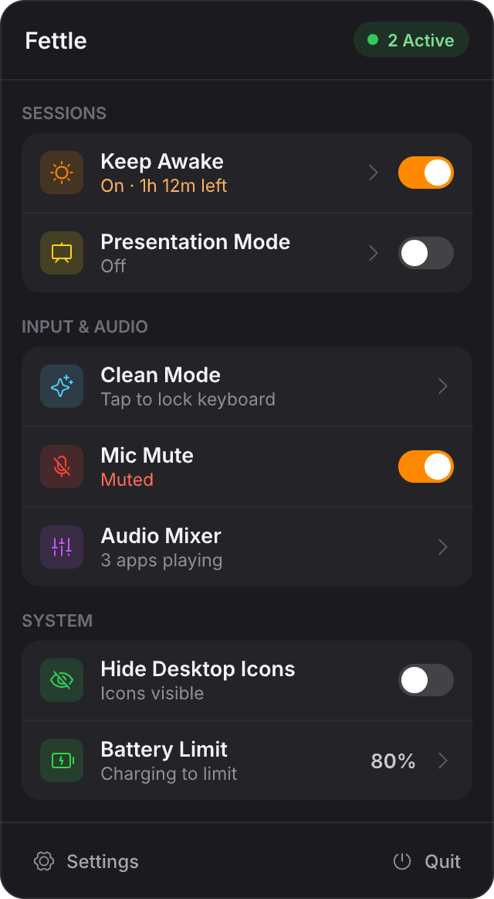
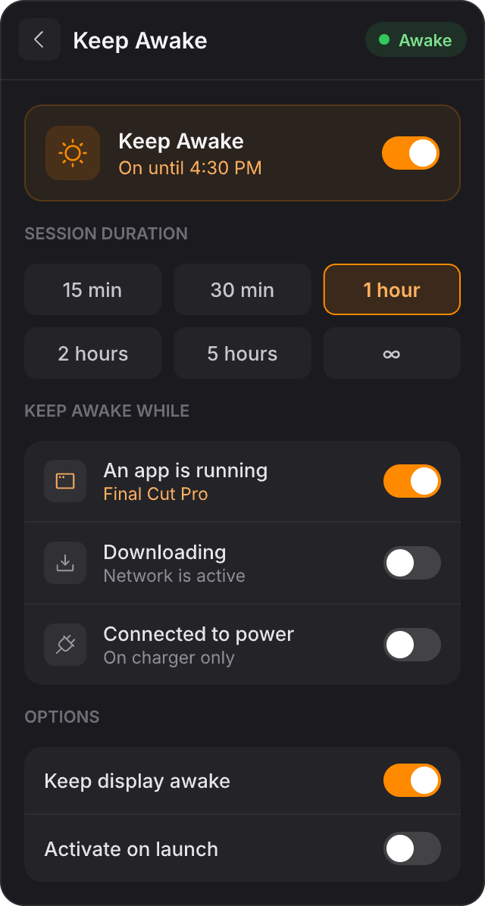
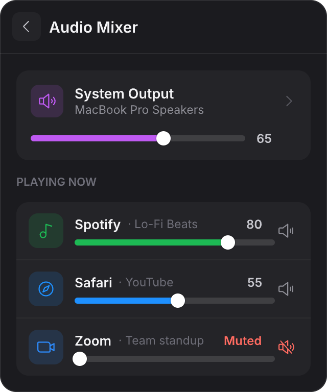
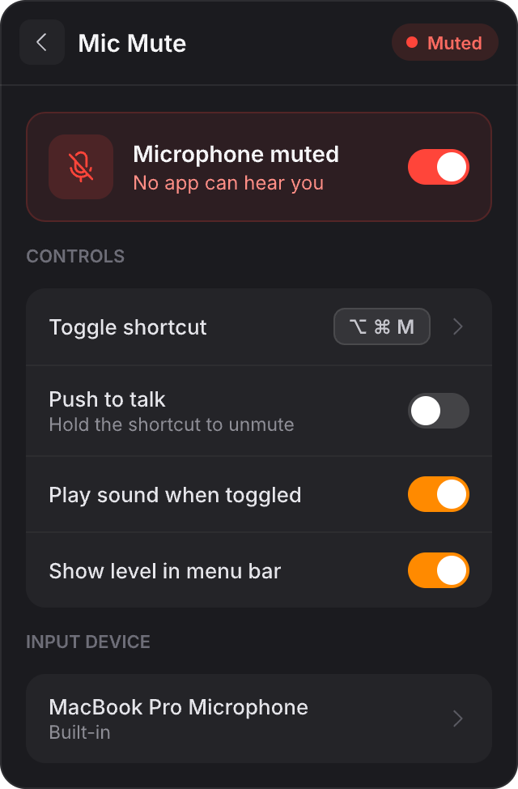
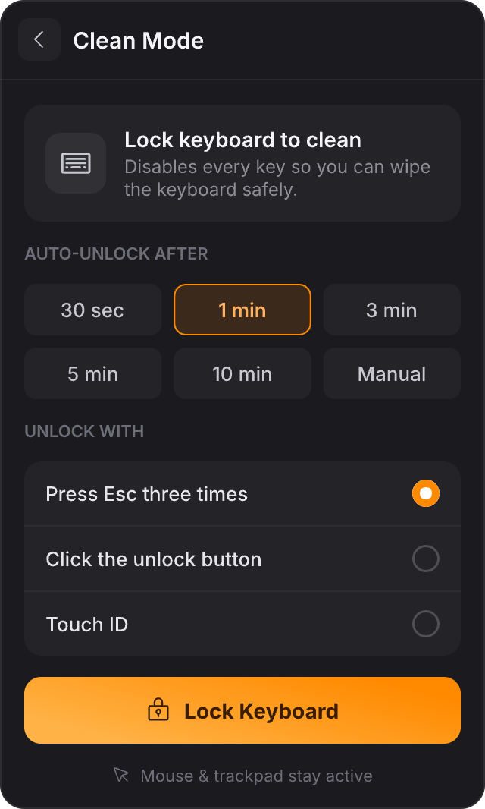
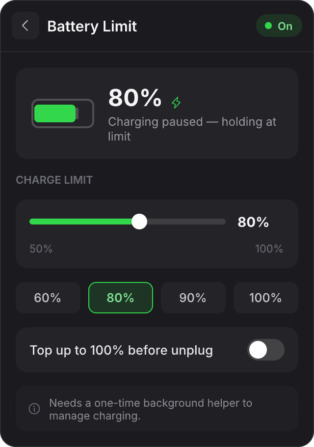
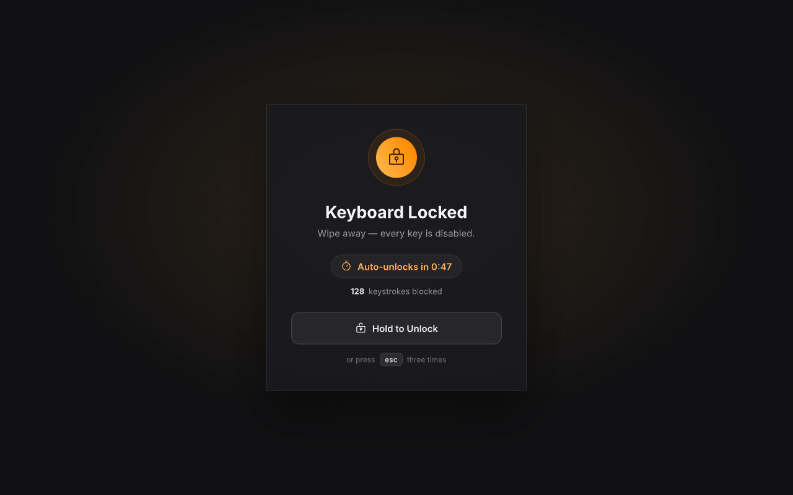

# Fettle

A menu-bar utility for keeping your Mac in good working order. Fettle starts with
**Keep Awake** and grows into a small control center of focused system tools — all
behind one menu-bar icon, no Dock clutter.

> **fettle** *(noun)* — condition or state of health, spirits, and form.

## Screenshots

<p align="center">
  
  
  
</p>
<p align="center">
  
  
  
</p>

Clean Mode's full-screen overlay while the keyboard is locked:

<p align="center">
  
</p>

<sub>Renders from the design file (<code>fettle.pen</code>); the shipping UI matches.</sub>

## Tools

| Tool | What it does |
|------|--------------|
| **Keep Awake** | Prevents sleep using IOKit power assertions. Indefinite or timed sessions, optional keep-display-awake, and triggers (while an app runs, while on AC power). On/off state and timers persist across relaunch. |
| **Clean Mode** | Disables the keyboard so you can wipe it down, with a full-screen locked overlay (live countdown + keystroke counter). Unlock by pressing `Esc` three times or holding the on-screen button. Mouse/trackpad stay active. |
| **Mic Mute** | Global microphone mute via Core Audio, with a `⌥⌘M` hotkey, push-to-talk, and input-device switching. |
| **Audio Mixer** | System output volume plus **per-app volume** using Core Audio process taps (macOS 14.4+) — lower or mute individual apps while they play. |
| **Hide Desktop Icons** | One toggle to clear the desktop for screenshots and screen sharing. |
| **Presentation Mode** | Composes other tools into one switch: keep display awake, hide desktop icons, mute mic, and turn on a Focus (via a Shortcut). |
| **Battery Limit** | Caps charging at a chosen percentage via a privileged helper that writes the SMC charge keys. |

## Architecture

Fettle is built around a small, pluggable tool model:

- `AppState` (an `@Observable` object) owns one self-contained object per tool.
- Every tool conforms to `FettleTool` (`title` / `symbol` / `tint` / `section` /
  `isActive` / `statusText` / `control`).
- The dashboard renders tool rows generically and routes to a per-tool detail view.

Adding a tool is: write one `@Observable` class, add it to `AppState`, and add a
case to the router. The UI and dashboard pick it up automatically.

The app is a `MenuBarExtra(.window)` SwiftUI scene running as an agent
(`LSUIElement`), and ships a second target — `FettleBatteryHelper`, a privileged
root XPC daemon registered via `SMAppService` — for the battery charge-control
keys that require root.

## Requirements

- macOS 27 or later
- Xcode 26 or later (Swift 6.4)

## Building

Open `Fettle.xcodeproj` in Xcode and run, or build from the command line:

```sh
xcodebuild -project Fettle.xcodeproj -scheme Fettle -configuration Release \
  -destination 'platform=macOS' build
```

The repo uses Xcode's file-system-synchronized groups, so new files under
`Fettle/` are picked up automatically.

> If `xcodebuild` reports *"requires Xcode, but active developer directory is a
> command line tools instance"*, point it at your Xcode:
> `sudo xcode-select -s /Applications/Xcode.app`.

Fettle is **not sandboxed** — the Clean Mode keyboard event tap and the battery
helper can't run under App Sandbox.

## Permissions

Fettle asks for these only when you first use the relevant tool:

- **Accessibility** — Clean Mode's keyboard event tap.
- **Audio recording** — Audio Mixer's per-app process taps.
- **Login Items approval** — the battery helper daemon (`SMAppService`).
- A user-created **Shortcut** named `Fettle Focus On` / `Fettle Focus Off` for
  Presentation Mode's Do Not Disturb (macOS exposes no public Focus API).

## Status

Actively built. Keep Awake, Clean Mode, Mic Mute, Hide Desktop, Presentation Mode,
device switching, global hotkeys, and preference persistence are implemented. The
**Audio Mixer per-app engine** and the **battery SMC helper** are implemented and
build, but their runtime behavior is hardware/permission-dependent and benefits
from per-machine verification.

## Contributing

Contributions are welcome — see [CONTRIBUTING.md](CONTRIBUTING.md) for how the
tool architecture works and how to add a new tool.

## License

[MIT](LICENSE) © Ngonidzashe Mangudya
